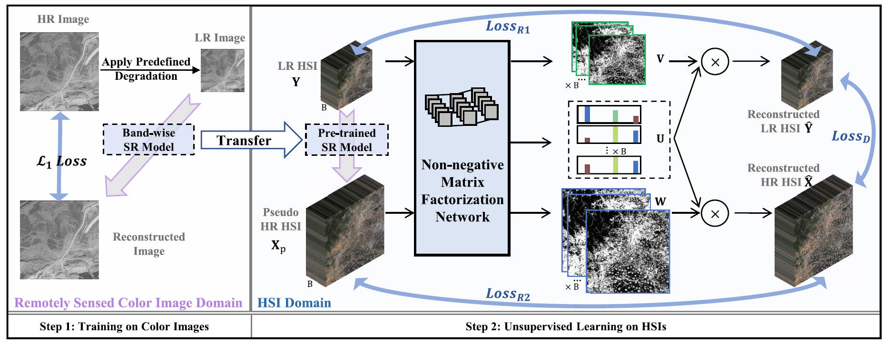

# TSBSR

Code for [this paper](https://ieeexplore.ieee.org/abstract/document/10231043).

**Blind Super-Resolution of Single Remotely Sensed Hyperspectral Image, IEEE TGSR (2023)**

[Zhiyuan Liang](http://zhiyuan0112.github.io/), Shuai Wang, [Tao Zhang](https://github.com/ColinTaoZhang), and [Ying Fu](https://ying-fu.github.io/).

## Introduction
In this paper, we introduce a two-step framework for blind remotely sensed HSI super-resolution, where the degradation is unknown.



## Prerequisites
* Python >= 3.6, PyTorch >= 1.7.1

## Getting Strated

### 1. Install the enviromemts
```bash
conda create -n tsbsr python=3.6
conda activate tsbsr

conda install -c conda-forge python-lmdb
conda install caffe
pip install --upgrade git+https://github.com/pytorch/tnt.git@master

pip install -r requirements.txt
```

### 2. Prepare datasets
- [Pavia Centre and University](https://www.ehu.eus/ccwintco/index.php/Hyperspectral_Remote_Sensing_Scenes#Pavia_Centre_and_University)
- [Washington DC Mall](https://engineering.purdue.edu/~biehl/MultiSpec/hyperspectral.html)
- [Salinas](https://www.ehu.eus/ccwintco/index.php/Hyperspectral_Remote_Sensing_Scenes#Salinas)
- [Kennedy Space Center](https://www.ehu.eus/ccwintco/index.php/Hyperspectral_Remote_Sensing_Scenes#Kennedy_Space_Center_(KSC))
- [Botswana](https://www.ehu.eus/ccwintco/index.php/Hyperspectral_Remote_Sensing_Scenes#Botswana)
- [Houston2013](https://hyperspectral.ee.uh.edu/?page_id=459)
- [Houston2018](https://hyperspectral.ee.uh.edu/?page_id=1075)

Prepare [AID](https://captain-whu.github.io/AID/) training set for training SwinIR.
```python3
python utils/gen_data/gen_train.py
```

### 3. Trian
#### Step 1

  - Train SwinIR

    ```python3
    python main.py -a swinir -p aid_blind --bandwise --lr 1e-4 -mlr 1e-5 -n 40 --ri 1 --dir /media/exthdd/datasets/hsi/lzy_data/AID/AID_64_Y.db -b 32  # Please change --dir to your AID.db path
    ```

#### Step 2

  Take Pavia University dataset as example.

  - Generate the pseudo HR HSI

    ```python3
    # 1. Generate testing noises
      python utils/transforms/noise/gen_noise.py -ht 340 -w 340 -b 103
    # 2. Generate LR HSI
      python utils/gen_data/gen_test.py # generate norm test
      python utils/gen_data/gen_lr.py --sigma 10 -k k1 --sf 4 -dn paviau
    # 3. Apply SwinIR to the LR HSI, generating pseudo HR HSI
      python test.py -a swinir -p noise10_k1_aid --noise 10 -ds k1 -dn paviau -rp logs/checkpoint/swinir/aid_blind/model_best.pth --bandwise
    ```

  - Unsupervised training

    ```python3
    python main_transfer.py -a cnn_103_128_64_blind_sparse -p noise10_paviau -ds k1 --noise 10 --dir logs/result/swinirY/paviau/noise10_k1_aid/PaviaU.mat -n 400 --lr 1e-3 -mlr 5e-5 --ri 50 -b 1
    ```
 
### 4. Test

```python3
python test_transfer.py -a cnn_103_128_64_blind_sparse -p noise10_k1 --noise 10 -ds k1 -dn paviau --dir logs/result/swinirY/paviau/noise10_k1_aid -fn PaviaU.mat -rp logs/checkpoint/cnn_103_128_64_blind_sparse/noise10_paviau/model_best.pth
```
 
## Citation
If you find this work useful for your research, please cite:

```bibtex
@ARTICLE{liang2023blind,
  author={Liang, Zhiyuan and Wang, Shuai and Zhang, Tao and Fu, Ying},
  journal={IEEE Transactions on Geoscience and Remote Sensing}, 
  title={Blind Super-Resolution of Single Remotely Sensed Hyperspectral Image}, 
  year={2023},
  volume={61},
  number={},
  pages={1-14},
  doi={10.1109/TGRS.2023.3302128}
}
```